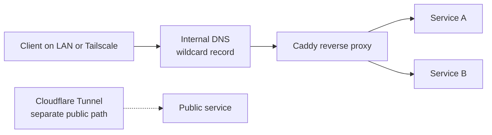

[Back to infrastructure](README.md)

This page describes the pattern, not the configuration.

## Pattern

Each service shares a small private network with the proxy only. The public path through Cloudflare Tunnel does not pass through this proxy.

## How it works

- A private internal domain has a wildcard DNS record that points clients at the proxy.
- Caddy handles internal reverse proxying.
- Services are intended to be reachable over LAN and Tailscale.
- Public exposure through Cloudflare Tunnel is a separate path and is not part of this proxy.
- Unknown hostnames should not automatically expose services.

## Why this design

- It reduces direct use of host ports and raw IP addresses.
- Names are easier to remember, document and move than address and port pairs.
- A single entry point is easier to reason about than many exposed ports.

## Status

The media stack is fully behind the proxy, and its direct host ports have been closed to the network. Other services will follow one at a time.

Proxying a service does not close its original port. That is a separate step, done only after checking what still depends on the port and repointing it. See [the dated entry](../journal/2026/2026-10-04.md) for how that went.

## Deliberately not published

Internal addresses, routing rules, credentials, firewall configuration and port lists.
