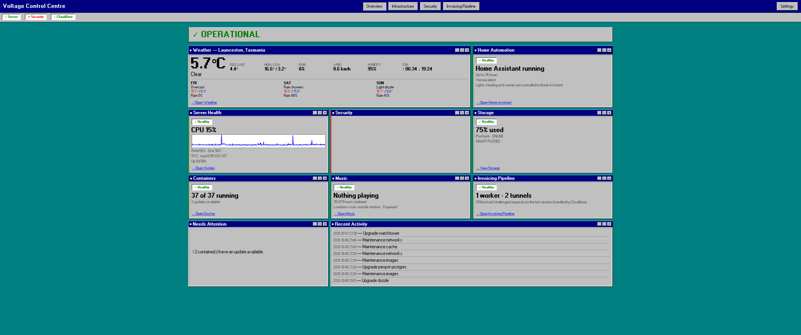
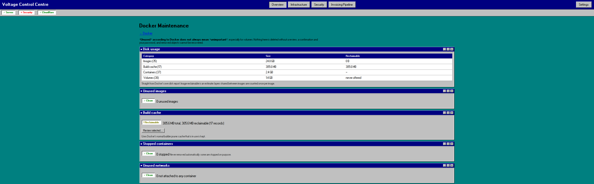

[Back to projects](README.md)

## Summary

Control Centre (formerly "Holocron") is the internal dashboard for my homelab. It groups Docker stacks automatically by Compose project, shows host health, tracks the Cloudflare-backed invoicing pipeline and doubles as a remote control for a self-hosted music library. A native display client, the [Holocron Kiosk](holocron-kiosk.md), shows it on a wall screen.

## Problem

Running a couple of dozen containers meant a pile of separate admin pages, remembered ports and overlapping dashboards. I wanted one place to see what was up, reach each service by name and spot problems early.

## Architecture

- A Flask and SQLite web service running as a systemd service on the lab host.
- One background poller per integration (Docker, system metrics, systemd, ZFS and SMART, UPS, weather, Cloudflare, a music server and others), each on its own schedule with its own error handling. A hung integration shows as a marked state and never blocks another poller or a page load.
- The service reads Docker through the local socket, so there is no SSH hop or agent between display and server.
- A Security page can scan the host and containers with Trivy and cross-reference known CVEs.
- SQLite keeps metric history for charts. Pages are served from the database plus an in-memory latest snapshot.

## Screenshots

*The overview page. The security panel is blanked out in this public copy.*

*Docker maintenance. It reports what could be cleaned up but never deletes anything without review and a confirmation. Cropped to the summary panels.*

## Technologies

Python, Flask, SQLite, waitress, systemd, Docker Engine API, Cloudflare API, Trivy, a PySide6 client, pytest.

## My role

- Defined what the dashboard had to show and which tools it should replace (Homarr and other overlapping dashboards).
- Chose the architecture, including isolated pollers and the move from a browser-based kiosk to a native client.
- Deployed and operate it, and updated its links as services moved behind the [reverse proxy](../infrastructure/reverse-proxy.md).
- Tested and debugged it in daily use and decided how it is exposed.
- **AI-assisted development:** most of the code was written with Claude. I reviewed behaviour, tested it on the real lab and made the design calls. I did not write it all myself.

## Key decisions

- **Isolated pollers.** A flaky external API must not freeze the rest of the dashboard.
- **Native client over a browser kiosk.** A Chromium kiosk brought a class of problems (reserved shortcuts, context menus, quirks from cheap remotes) that a plain Qt window does not have.
- **Replace, don't add.** Homarr was removed once this covered what I used it for. Fewer dashboards means fewer things to keep correct.

## Security considerations

- Internal use only, over LAN and Tailscale. It is not published to the internet.
- It can see container state, so it is treated as an administrative interface and reached through the private proxy.
- Limitation: it runs on the same host it monitors, so a whole-host outage takes it down too.

## Testing and validation

- The project repo has a pytest suite. Beyond that I rely on day-to-day use against the real stack, and I check links and monitors after each service migration.

## Problems encountered

- Renaming the app changed the HTTP user agent and the client name sent to the music server, which then showed a new player entry. Harmless, but a reminder that a display rename can be visible to other software.
- Internal package and service names still carry the old Holocron name for compatibility. Migrating them is a separate, later job.

## Current status

In use and evolving.

## Lessons learned

- Give every integration its own failure state, so one dead dependency cannot take the page down.
- After any service move, repoint the dashboard links and the monitors before calling it finished.
