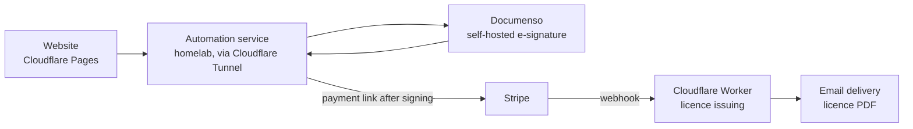
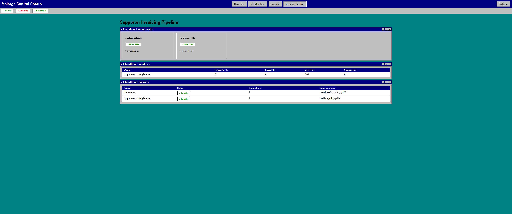

[Back to projects](README.md)

## Summary

Supporter Invoicing is a proprietary desktop invoicing and expense app for Australian sole-trader support workers, covering GST and an end-of-financial-year summary. It is live, with a public website at [supporterinvoicing.com.au](https://supporterinvoicing.com.au). This page is about the pipeline around the app: the website, the signed-agreement step, payment, licence issuing and releases. The source is in private repositories.

## Problem

Selling software takes more than the app. A buyer has to agree to terms, pay and receive a working licence, and I needed that to run without me handling each sale by hand. Installers also have to be built, signed and delivered safely.

## Architecture

- **Website:** static pages on Cloudflare Pages. Its server-side functions hold the API token, so it never reaches the browser.
- **Signed agreement first:** a small service on the homelab collects a signed agreement through a self-hosted Documenso instance before anyone is given a payment link. It is rate-limited and reached only through a Cloudflare Tunnel.
- **Payment:** Stripe. A verified webhook triggers licence issuing.
- **Licences:** a Cloudflare Worker signs one licence token per seat, bundles them into a PDF and emails it. A small KV store records the first device to activate each key, and the app needs the internet only for that one check.
- **Releases:** installers are built in CI for Windows, macOS and Debian, signed, published to object storage and listed in a manifest. The app checks the manifest and verifies a SHA-256 digest before opening an installer.
- **Visibility:** the [Control Centre](control-centre.md) shows the pipeline's health.

The Control Centre's view of the pipeline (container health, the Cloudflare Worker and the tunnels):

## Technologies

Python (Flask, SQLite), Cloudflare Pages, Workers, KV, R2 and Tunnel, Stripe, Documenso, Resend, Docker Compose, GitHub Actions, Inno Setup, code signing.

## My role

- Defined the product, the purchase flow and the order of steps (agreement, then payment, then licence).
- Chose and connected the services, and deployed the website, Worker and homelab services.
- Set up the secrets handling and the tunnel exposure, and tried out failing the automation service over to a second machine as a test.
- Tested the whole purchase flow end to end, debugged failures and documented the setup.
- **AI-assisted development:** the application and service code was written mostly with Claude. I specified it, tested it and run it.

## Key decisions

- **Sign before pay.** The terms are agreed before a payment link exists, so the Worker never needs to know about agreements.
- **Keep secrets server-side.** The browser never sees the automation token. Secrets live in git-ignored files or Worker secrets.
- **No inbound ports.** The homelab services are reached through an outbound Cloudflare Tunnel.
- **Signed installer over a store package** on Windows, to avoid store review for each release.
- **Online check once, then offline.** The app makes a one-time online check that a licence key is valid, then needs no internet connection. Licence tokens are signed, so the app can verify them without calling home each time.
- **Back out risky gates.** An earlier licence-key gate stopped the packaged app launching and was reverted before the current activation check replaced it.

## Security considerations

- Stripe webhooks are verified before a licence is issued, and the automation endpoints are token-authenticated and rate-limited.
- Licence tokens are signed, and update downloads are verified by digest.
- The signing service's key was once committed by accident. The [incident case study](../security/incident-response.md) covers how it was contained and rotated.
- Limitation: a lost licence email means a manual re-issue for now.

## Testing and validation

- The app has an automated test suite, and CI builds the installers.
- I test the purchase flow end to end, from the website through signing and payment to the licence email, after changes.

## Problems encountered

- The licence-gate regression above.
- A signing certificate that failed twice after rotation because of file permissions and a special character in an environment variable.
- The key incident, found by chance rather than by a scanner. That is why there is now a fail-closed secret-scanning hook.

## Current status

Live.

## Lessons learned

- Put each trust boundary in one place: signing first, then payment, then licence.
- Test the packaged app and the whole flow, not just the source tree.
- Plan how to revert before shipping anything that can stop the app launching.
